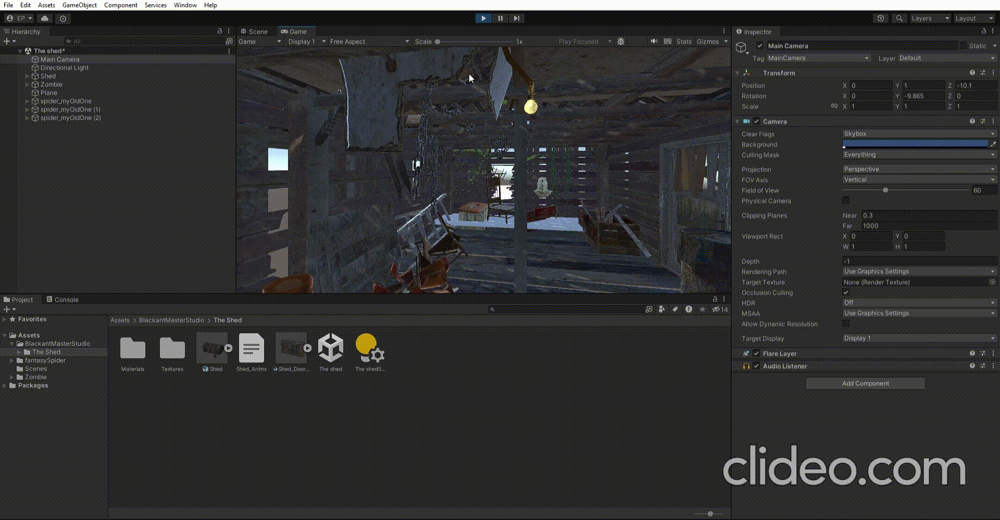
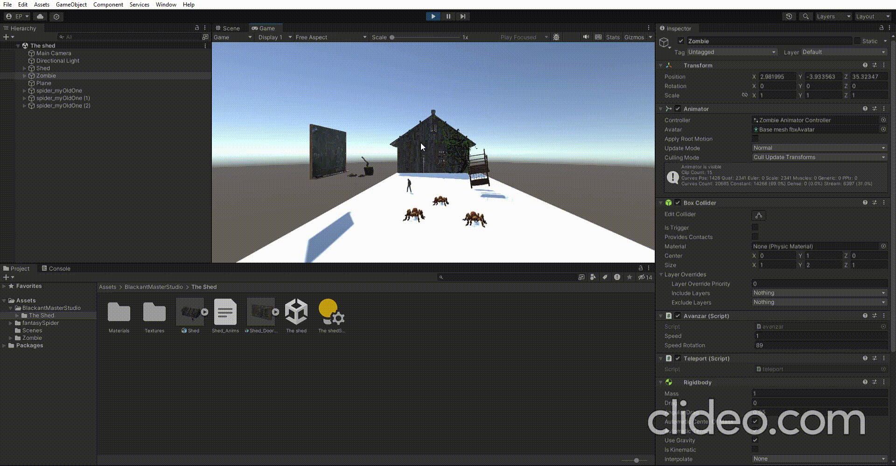

# examen_interfaces_inteligentes
### ejer2: desplazar el zombie y que cuando no se toca una tecla que avance hacia delante

### ejer3: cuando pulsa la tecla T el zombie se telatransporta

### ejer4: desplaza aleatoriamente las macetas cada vez que el monstruo esté a una distancia que fijes de la pizarra y le acerque las sillas una distancia prefijada.

### ejer5: al alcanzar el monstruo alguna silla todas las arañas se dirijan a él.

### ejer6: configurar cardboard.

